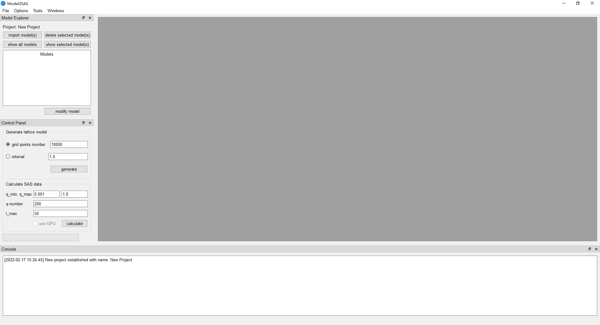
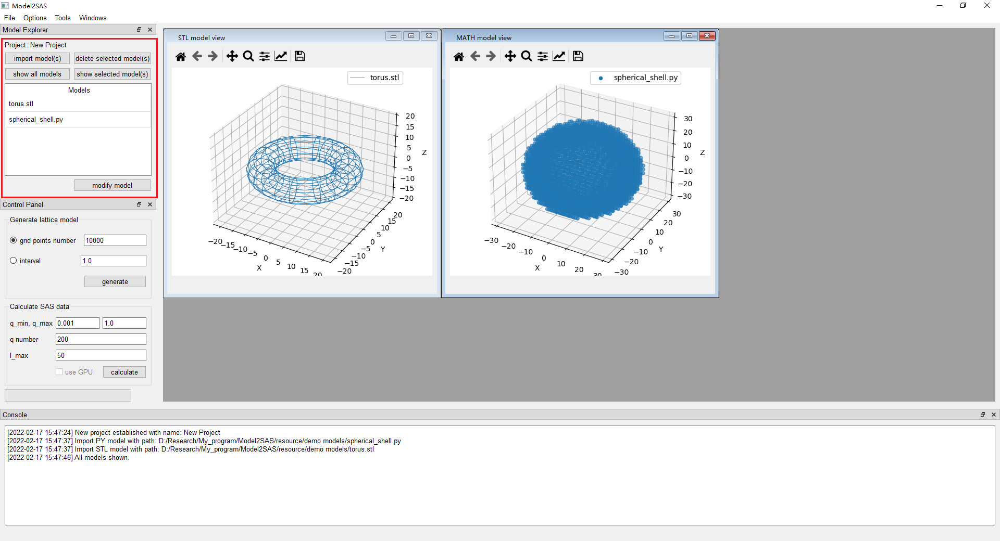
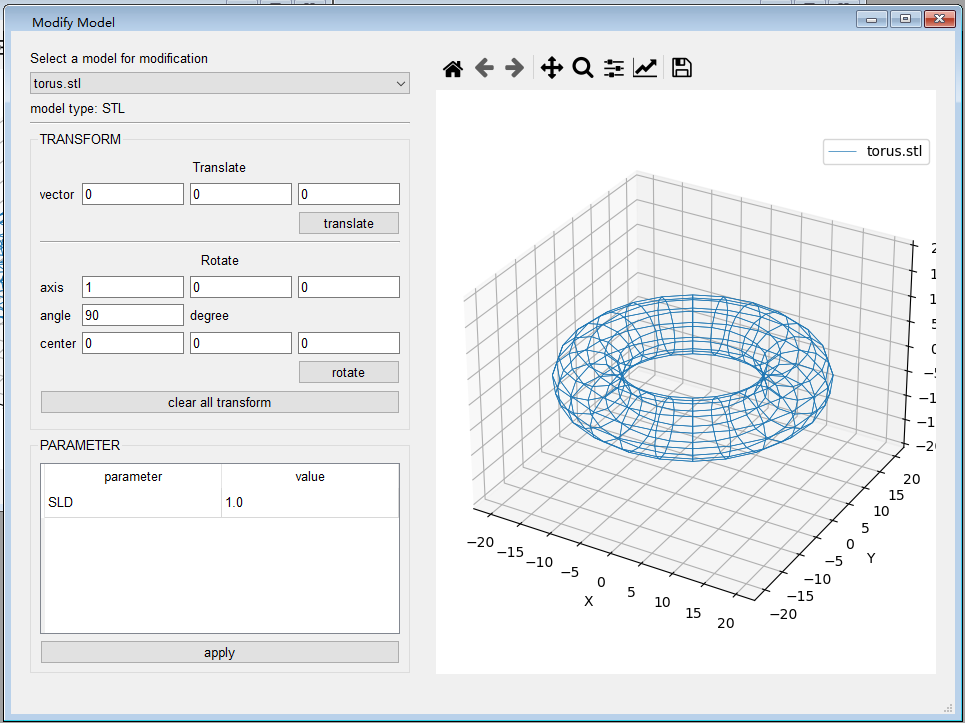
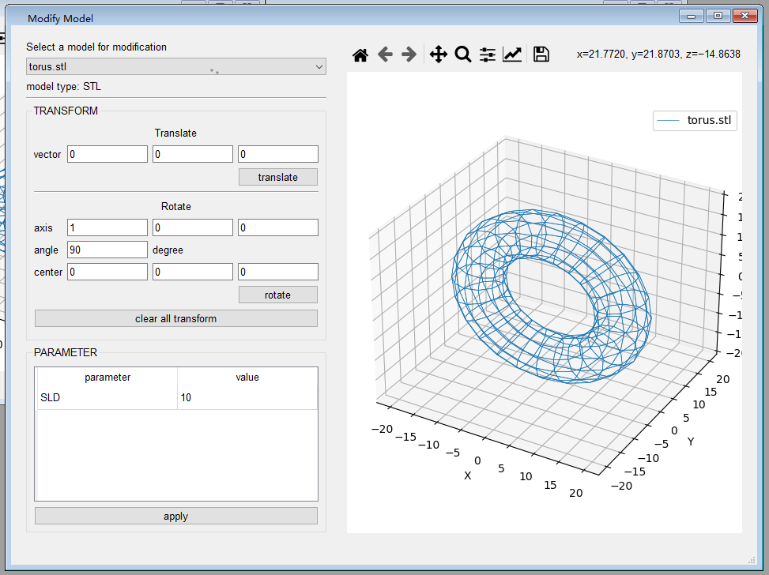
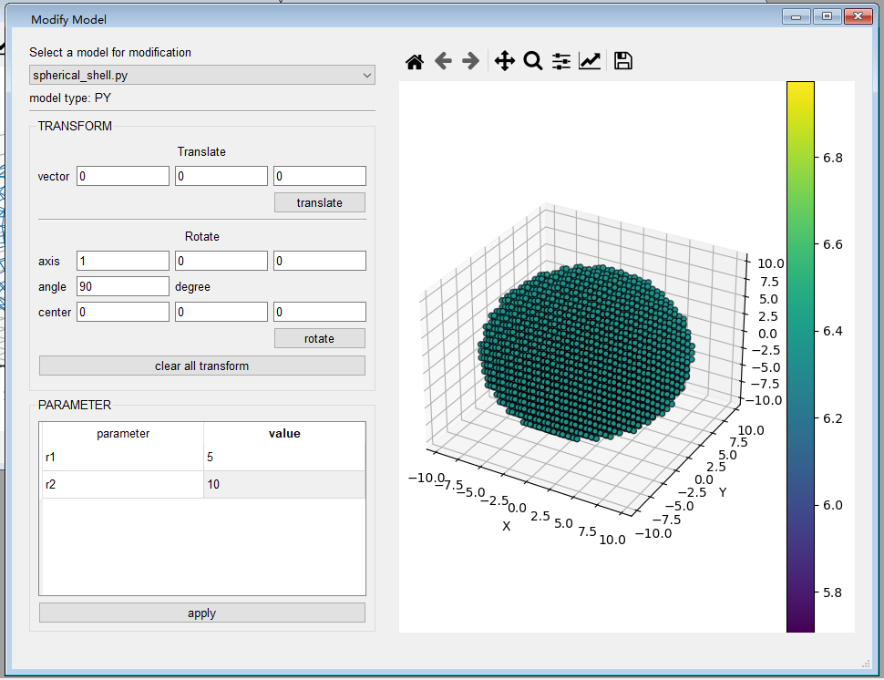
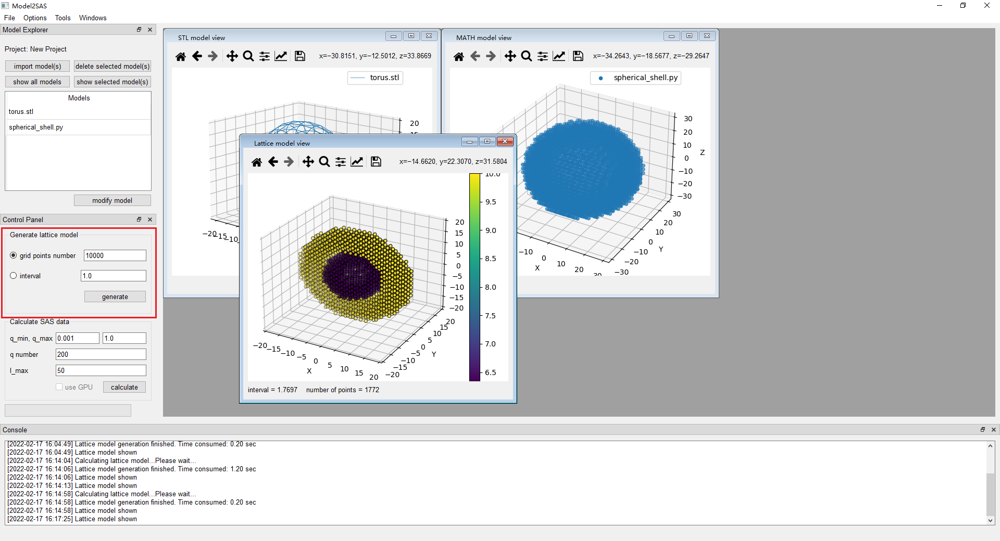
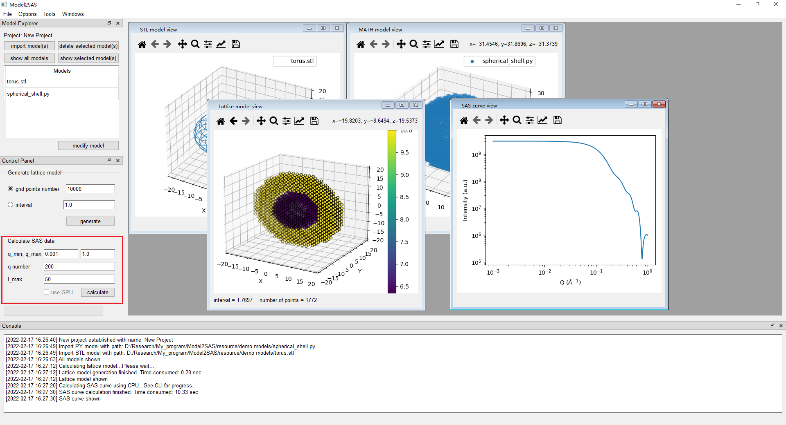
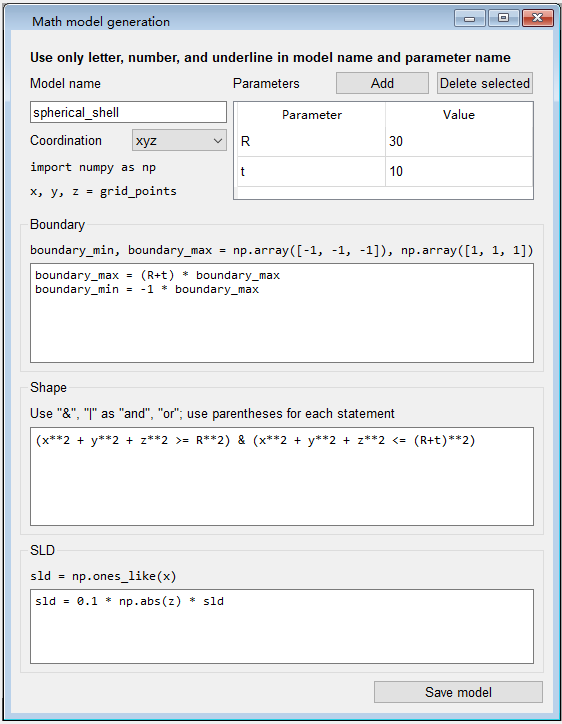
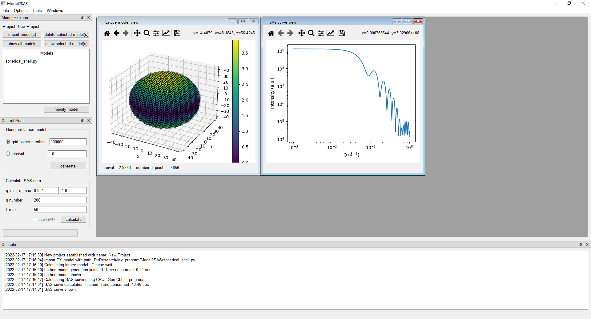

# Model2SAS

Program to generate small angle scattering curve from 3D models. Models can be STL file and/or math description by .py file. Both module and GUI are available for convenience.

## Installation

An EXE installation file is available on Windows platform, which doesn't need python environment. For advanced user or Mac and Linux platform, user need to run from source codes. Please refer to the requirements. 

To run GUI from source:

```shell
python MainWindow.py
```

### Requirements

Below lists the versions in development. But any recent version should be OK.

- Python 3.8.5
- numpy 1.19.2
- scipy 1.5.2
- matplotlib 3.3.2,
- numpy-stl 2.13.0
- psutil 5.7.2

Additional for GUI:

- PyQt5 5.15.2

Optional for GPU acceleration:

- PyTorch 1.9.0

## Quick start



The main components are menu bar (top), model panel (upper left), calculation control panel (bottom left) and console (bottom). Menu bar contains may options that are pretty clear by their names. Main functions are all listed in model panel and calculation control panel. The work flow is: import models -> modify models (optional) -> generate lattice model -> calculate SAS curve. Models used in this tutorial is available in  /resource/demo models

### Import models

Push the button "import model(s)" will pop up a window to select model files to import. Only .stl file and .py  file are allowed. Then the imported models will be listed on the model list. You can view the models in 3D view by push "show all models" button or "show selected model(s)" button. Here, we import 2 models for example,  `torus.stl` and `spherical_shell.py`, both available in folder `./resource/tutorial models/`.



### Modify models

Sometimes the position or parameters need to be adjusted before calculates the cumulated lattice model, then you can use model modify tool by push "modify model" button under model list. It will pop up a window like this:



First select the model you want to modify, then the parameters and 3D view will be shown. You can translate the model by vector, or rotate the model by a certain degree around an axis through a center point, which are all feasible by entering coordinates and vectors. To change the parameters, just modify the figures in the table. Please push "translate", "rotate" or "apply" button after changes are made otherwise they will not be applied. Now we rotate the torus model by 90 degrees around X axis, and change the SLD to 10.



For STL model like torus, only SLD parameter can be altered. But for math model, the geometrical parameters can also be altered. here, we change the inner and outer radius of spherical_shell model to 5 and 10.



After all the modification finished, you can close this window.

### Generate lattice model

Then you can generate a lattice model by just pushing the "generate". Parameter of generating lattice model is grid points number or interval, which are either-or parameters both control the density of lattice model generated. After push the button, calculation will begin and you can judge the status by the progress bar. A 3D view window of lattice model will pop up when calculation finished. The SLD distribution is exhibited by its color and the corresponding color bar. At the bottom of this window shows the interval and number of points in the lattice model. You can always change the parameters or even modify models and then generate the lattice model again. The new lattice model will be shown in a new window and the older one will close automatically. Although the 3D view window still remains, the older lattice model will not be retained. If you are not certain, please check the current lattice view by Menu Bar -> Windows -> Show lattice model.



### Calculate SAS curve

After the lattice model generation, you can calculate the SAS curve of this lattice model. Parameters are q_min, q_max, q number and l_max. q_min, q_max determine the q range of SAS curve, q number determines the number of points in the curve, l_max determines the maximum order of harmonics. After setting proper parameters, you can calculate SAS curve by push "calculate" button. Still, you can judge the status by progress bar. When calculation finished, a SAS curve window will pop up.



The "use GPU" checkbox will only be available after configuring PyTorch by MenuBar -> Options -> Configure GPU with PyTorch. For now this is only available when run from source codes and PyTorch installed. This is only experimental now.

### Tool for generating math model

Math model is described in python language. Here is a little tool that helps you generate a math model easier and quicker.  Essentially, this tool will generate a python file, so the variables names and syntax must obey python syntax. I recommend referring to the `mathmodel_template.py` file for detail that a math model is actually a python class. Nevertheless, I'll give a example here. 

Let's build a spherical_shell model described in cartesian coordinate system. Define the inner radius is $R$ and thickness is $t$ Then the condition is $x^2+y^2+z^2 \geq R^2$ and $x^2+y^2+z^2 \leq (R+t)^2$. And we set the SLD change with with coordinates as $SLD(x,y,z)=|z|/10$. Then it will be inputted as follow:



First, define the parameter and their initial values. Then write the boundary conditions. Imagine a box that can contain the whole math model, boundary_min and boundary_max are the coordinates of the two corners of this box, which is $(-(R+t), -(R+t), -(R+t))$ and $(R+t, R+t, R+t)$ here. Next, define the shape by conditions $x^2+y^2+z^2 \geq R^2$ and $x^2+y^2+z^2 \leq (R+t)^2$. Finally, define SLD distribution, $SLD(x,y,z)=|z|/10$. Here numpy module is imported as np by default, so we can use function in numpy  like `np.abs()` directly, which should be enough for most of the cases. If more complicated conditions are needed, please write your own math model class referring to `mathmodel_template.py` file. Save the model file and then you can use it as we introduced above. Here is the result of the spherical shell model with special SLD distribution:



### Other functions

- All the plots can be saved by the save button in toolbar located in each plot window. Or you can also modify the appearance of each plot. 
- Lattice model can be exported in both ASCII file (txt) and PDB file. By exporting PDB file, you can calculate the SAS curve using other software like CRYSOL. But attention, all SLD information will be lost in the exported PDB file.

## Attention

- In the SAS plot, unit of $q$ is $\AA^{-1}$ by default. But be aware that the actual unit is the reverse of length unit in model file. For example, if the sphere with radius=30 means 30 nm, then the unit of $q$ should be $nm^{-1}$

## Future plans

- Implement more SAS curve calculation method.
